## Data Analysis of the King County House Sales dataset

In the [notebook](https://github.com/leorlik/king-county-houses/blob/main/Notebooks/Data%20Analysis%20House%20Prices.ipynb) in this directory, it was maded a data analysis of the [King County House Sales Dataset](https://www.kaggle.com/datasets/harlfoxem/housesalesprediction). The dataset contains 21602 data samples of house sales between May, 02, 2014 and May, 27, 2015 in King County, USA, with 21 columns including id. 175 houses appears twice in the dataset (which means 2 sales of the same house) and one house appear 3 times. The chart below shows how many sales happened per month in this time period.

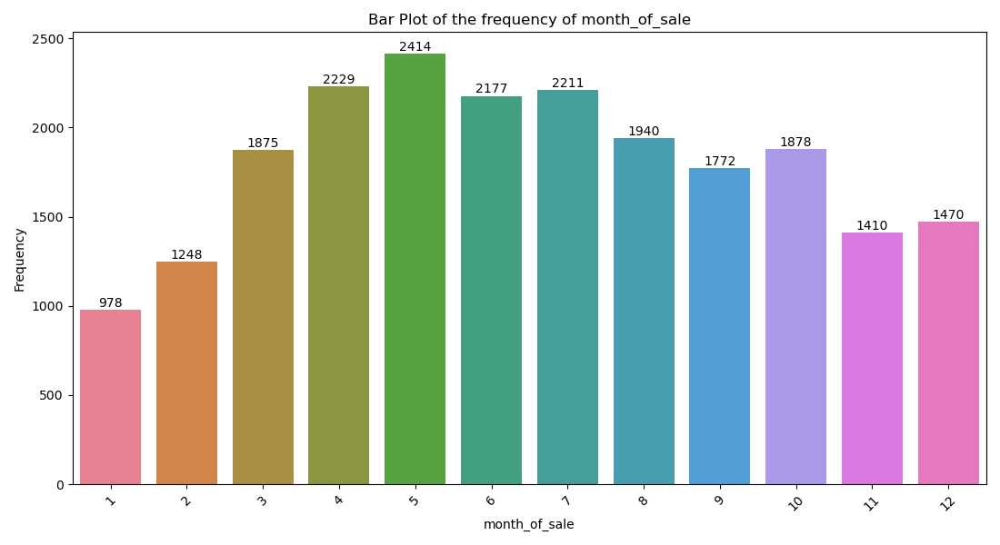

Even though May seems the strongest month for sales, with 2414 sales, there's an intersection between 2014 and 2015 sales in this month. When taking that under consideration, May, 2014 had 1768 sales, while May, 2015 had only 646 sales. Thats a average 1207 sales in may (with May, 1st, 2014 and after May 27th, 2015 not considered). The mean value of the house prices does not seems to vary significantly for the month the sale took place, as the chart below shows.

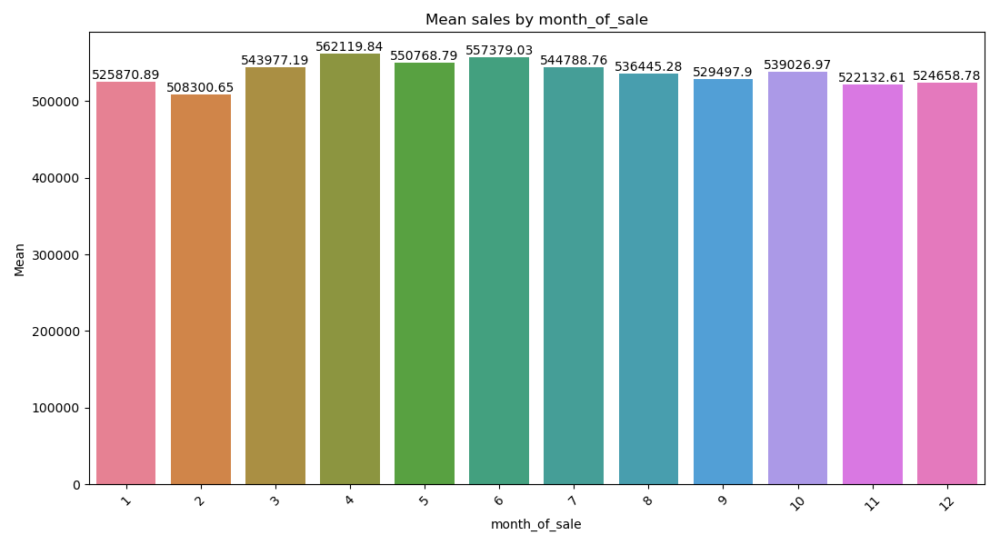

When talking about the year of the sale, comparing by years isn't fair since the 2014 year counts 8 months and the 2015 year has only 5 months in it's scope. However, a way of comparing those years is by average sales per month. As the bar chart below shows, 2014 has an average 1827,1 sales per month, while the next year got 1396.

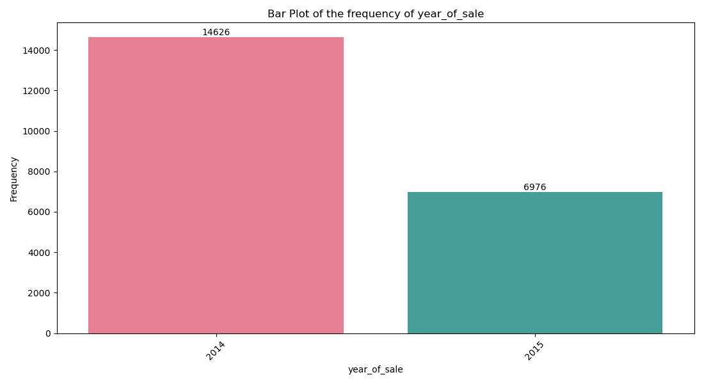

While it could be seem like the house sales market had more sucess in 2014 than 2015, this could also mean that sales in the second half of the year happen more than in the first (since the 2014 samples mostly cover this half). A way of visually confirm this is looking at the seasons of the year.

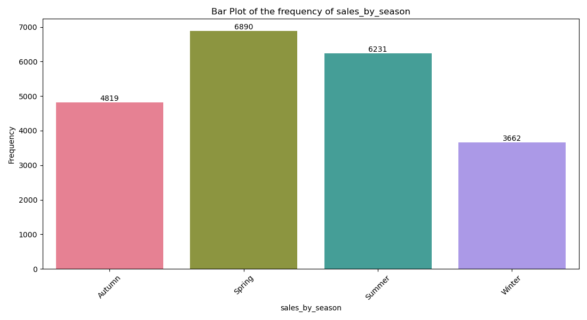

It's still worth to remind the spring intersection in May, still doesn't change the fact that part of the spring sales are in 2014. Besides that, it's hard to categorize Spring sales since the intersection and none of the year has a full spring time range. Mostly of the sales in a year actually seems to take place in summer (6231) while the autumn sales are stronger than the winter ones. Autumn and summer are both in the 2014 samples, and most of the winter and spring are in the 2015 year samples, making the idea of mostly sales happening in the summer a stronger hunch. Lets take a look at the average and middle prices of the sales by season.

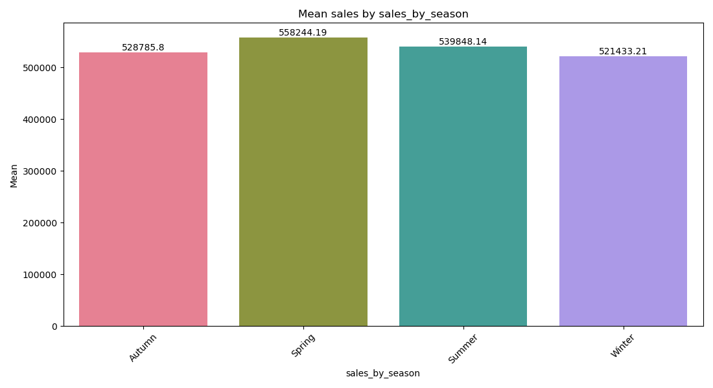

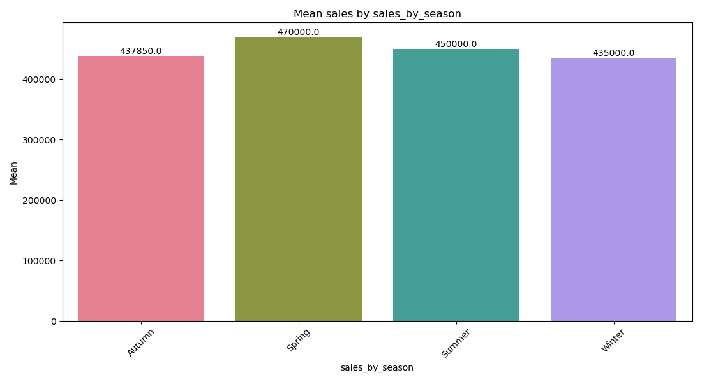

The mean and median of the sales are bigger in spring, followed by the summer. This could either means that real state brokers can reach bigger saler values in hot seasons or the profile of the houses that sells in these seasons are more expensive than the other ones.  

### Excluded Data

The data samples that were excluded from the analysis are:

- A sample that has 33 bedrooms and 1620 square feet;
- Samples with 0 bathrooms;

Its weird a house with that many bedrooms, specially with the low square feet, and also houses with 0 bathrooms. With that in mind, 11 rows were excluded. 

### Correlation of the variables

The top 10 variables correlation matrix shows us that price has high or average direct correlation with sqft\_living, grade, sqft\_above, sqft\_living15, bathrooms and view (the last one rounded from 0.397). Not only that, but this matrix also shows that the top 5 correlated variables has some correlation between then. Taken this into account, probably the variable creation process shouldn't been focused between these variables.

### House prices

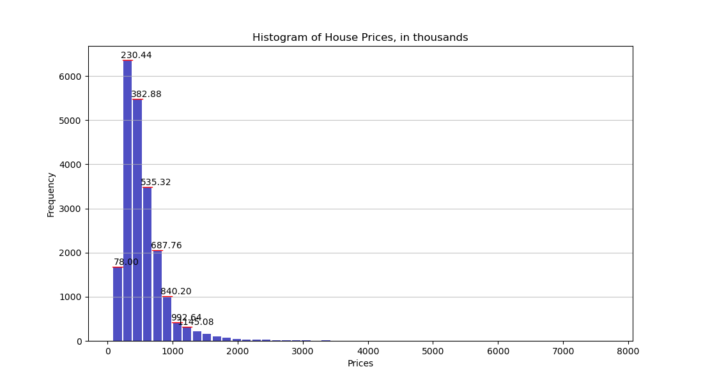

The histogram shows that mostly houses has prices between 75 and 1142 thousand dollars, with a bigger concentration between 227.5 and 532 thousand dollars. Since the distribution isn't clear, couldn't fit a statistical distribution like norm or such. 

The prices of the sales vary between 75 and 7700 thousand dollars, with a mean of 5400.9 thousands and a median of 4500 thousand (similar with what whas shown in the month and seasons bar plots). The standard deviation is very high (3671.28), meaning the data is very sparse, specially because of the outliers. 

### Analysing the variables

#### Condition and View

Below, the pie charts show the percentage distribution of both condition and view variables.

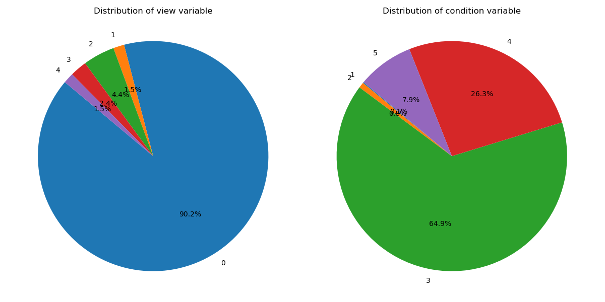

Mostly data samples has a 0 view value, which means the view of mostly houses isn't great, but could also means that the majority of the views weren't rated, so the default value was 0. Maybe that variable should'nt be taken into account. Below, the scatter plot of those variables show that their possible correlation with the price isn't direct.

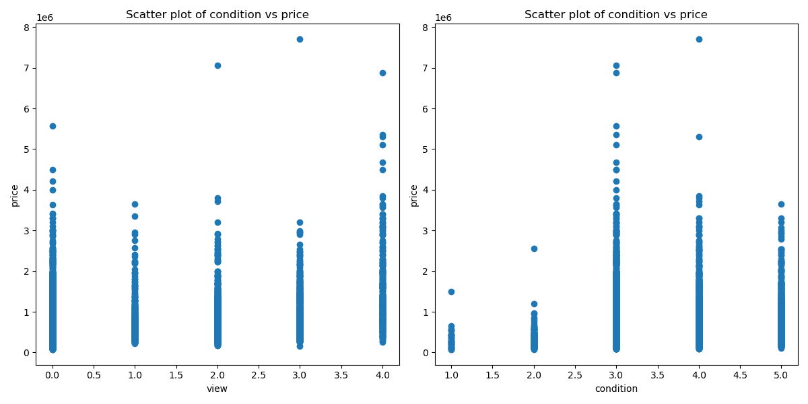

#### Bedrooms and Grade

Below, the histograms shows the distribution of the variables grade and bedrooms.

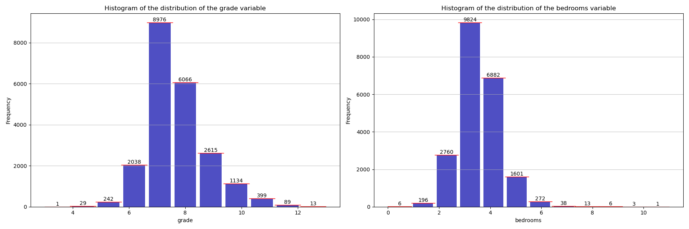

As the histogram shows, the majority of the grades are between 6 and 10, with 7 being the value that dominate the variable values. As for the rooms, the values with mostly samples are between 3 and 5, with 3 being the value with the majority of samples. Since the grade of the sample has a bigger correlation with the price, the correlation with values between 6 and 10 were better explored in the boxplot chart:

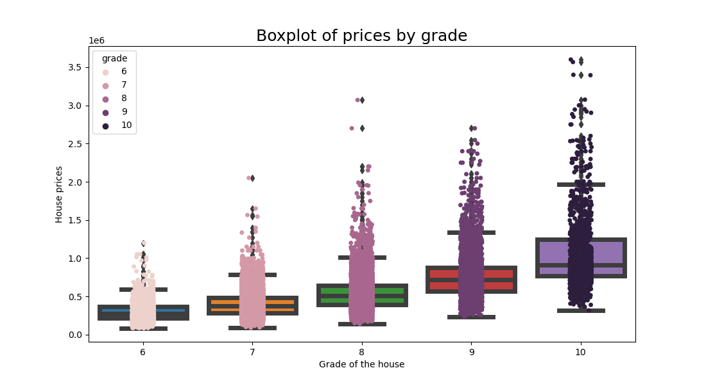

The boxplot, as expected, show that the higher the grade, higher the price, reforced by the median price. The scatter plot of grade and price below also shows that is visually possible to stablish some relation between the grade and the price, althought isn't that easy to determine a range just with that variable

#### Floors and Bathrooms

Below, the histograms of the distribution of floors and bathrooms variables.

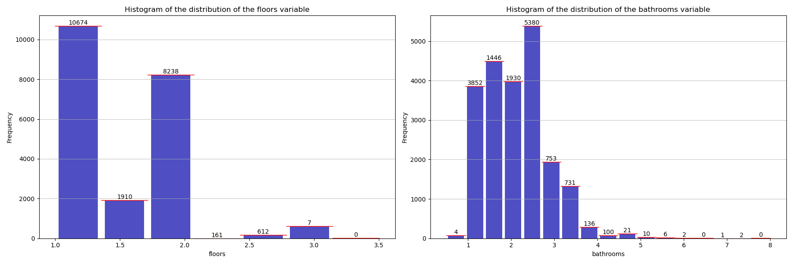

The maximum floors of a samples are 3.5, and the majority of the samples have 2 floors (8241 samples). As for the bathrooms, the samples has mostly 2.5 bathrooms. Since the bathroom variable has 0.53 correlation with the price, the scatterplot of those variable was maded.

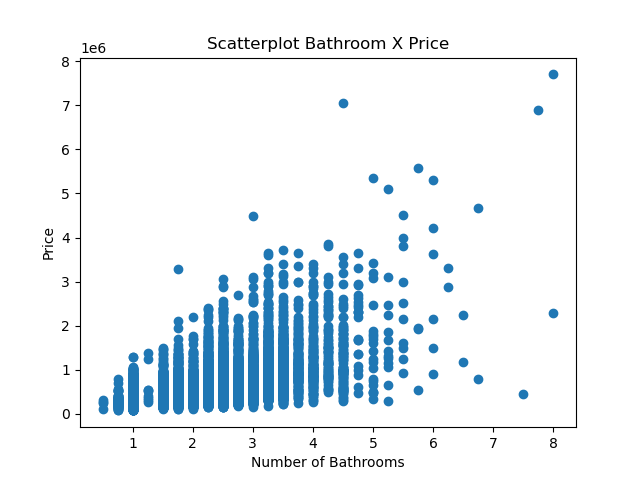

The visual evidence indicates that bathrooms and price does not have a clear linearity.

#### sqft\_living

The sqft\_living (square feet of the living area of the house) is the sum of the sqft\_above and sqft\_basement variables, being equal with the sqft\_above when there's no basement. This variable is important because it has the bigger correlation with price (0.7). The boxplot below shows the distribution of the sqft\_living variable.

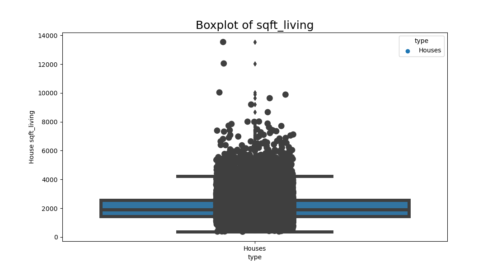

Data concentrates around a median value of 1910 square feet, with a minimum value of 370 and a maximum value of 13540 and a standard deviation of 918, a big value. However, the dataset has only 517 outliers, a small number compared to the not excluded 21602 data samples. 

The chart below shows how the price vary among the square feet of the living area:

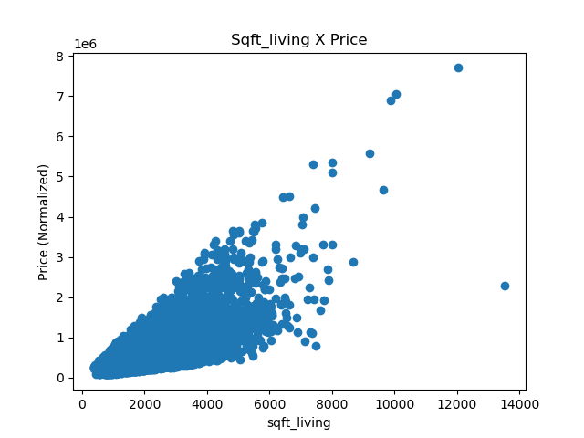

It seems to has a clearly relation between these variables as the correlation indicated before. Since sqft\_living has a wide range of values, it's maybe a good idea to project these variable in log space as the chart below shows:

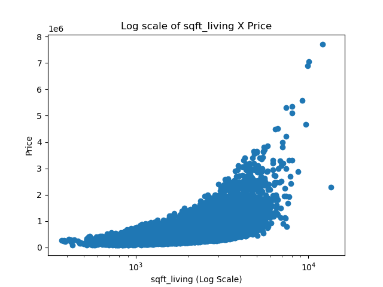 Scatter log sqft\_living x Price

To better illustrate the sqft\_living and price relation, it was maded a boxplot that shows the price in relation to the quartile of the square feet of the living area, showing that indeed has a relation.  

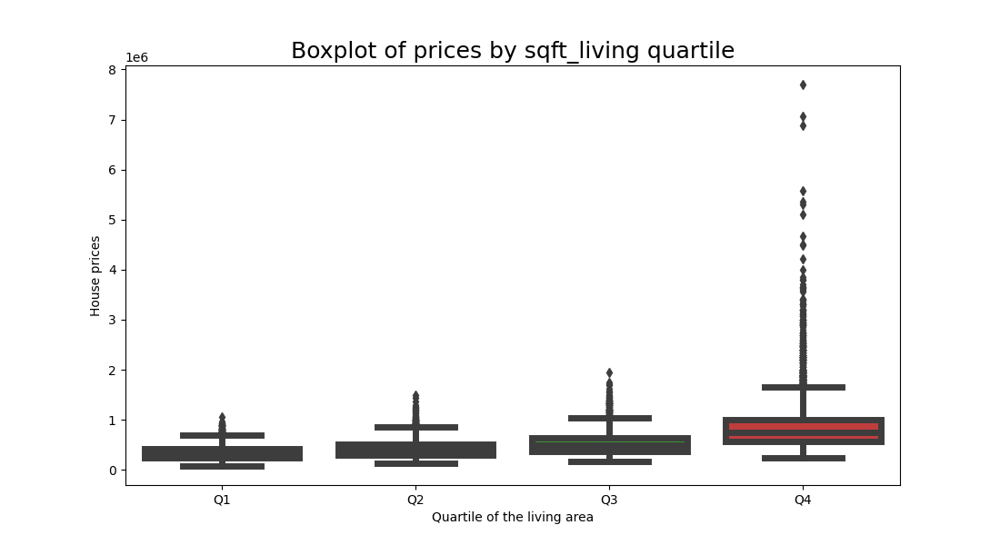 Boxplot quartile of sqft\_living x price

#### sqft\_living vs sqft\_living15

The sqft\_living15 variable means the average living area of the 15 nearest neighbors, in square feet. The dataset has 2565 houses with equal sqft\_living15 area, 9837 houses with bigger living area than the 15 nearest neighbors, and 9200 smaller ones. It could mean that these 2565 houses where built in condominium area. The difference could also tell how the neighborhood influences the price of a house. The boxplot below shows the difference between these two variables:

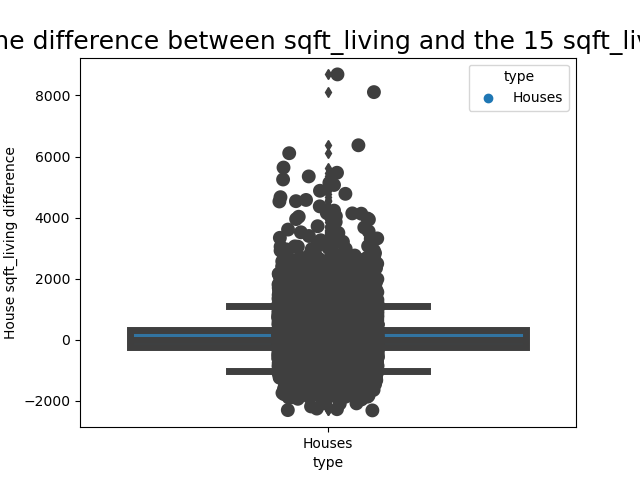

As the chart shows, the median value is 0, but the standard deviation is around 600 square feet. It also seems like the houses that the difference when sqft\_living15 is bigger is much less than the potential difference when sqft\_living is bigger, showing that a big house isn't necessarily near big houses. The mean of the absolute difference, otherwise, is 260. When plotting these two variables, it also seems like there's some relation:

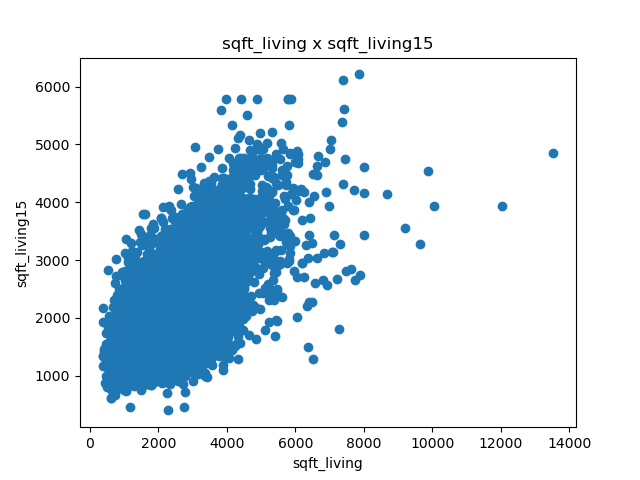

When transfering sqft\_living15 to a log space, it also looks like it has some relation to the price:

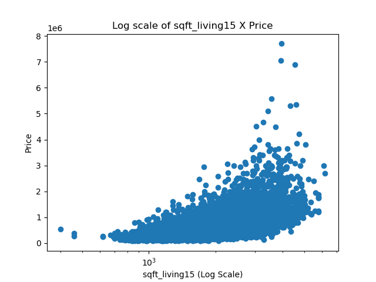

#### sqft\_lot

The lot area, another continuous variable, does not seems to have direct relation with the price, as the chart shows:

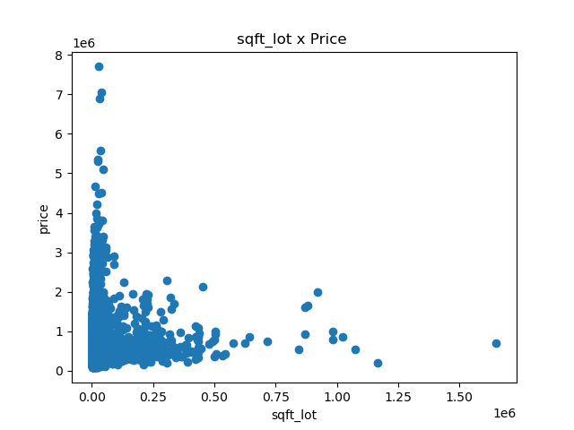
