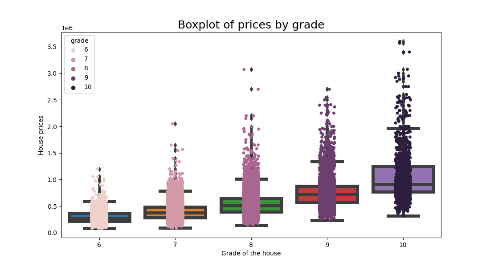

## Data Analysis of the King County House Sales dataset

In the [notebook](https://github.com/leorlik/king-county-houses/blob/main/Notebooks/Data%20Analysis%20House%20Prices.ipynb) in this directory, a data analysis was conducted on the [King County House Sales Dataset](https://www.kaggle.com/datasets/harlfoxem/housesalesprediction). The dataset contains 21,602 data samples of house sales between May 2, 2014, and May 27, 2015, in King County, USA, with 21 columns including an id column. 175 houses appear twice in the dataset (which means 2 sales of the same house), and one house appears 3 times. The chart below shows how many sales occurred per month during this time period.

Even though May seems to be the strongest month for sales, with 2,414 sales, there's an intersection between 2014 and 2015 sales in this month. When taking that into consideration, May 2014 had 1,768 sales, while May 2015 had only 646 sales. That's an average of 1,207 sales in May (with May 1st, 2014, and after May 27th, 2015 not considered). The mean value of the house prices does not seem to vary significantly for the month the sale took place, as the chart below shows.

When talking about the year of the sale, comparing by years isn't fair since the 2014 year counts 8 months and the 2015 year has only 5 months in its scope. However, a way of comparing those years is by average sales per month. As the bar chart below shows, 2014 has an average of 1,827.1 sales per month, while the next year got 1,396.

While it could be seem like the house sales market had more sucess in 2014 than 2015, this could also mean that sales in the second half of the year happen more than in the first (since the 2014 samples mostly cover this half). A way of visually confirm this is looking at the seasons of the year.

It's still worth reminding the spring intersection in May; however, it doesn't change the fact that part of the spring sales are in 2014. Besides that, it's hard to categorize spring sales since the intersection and none of the years have a full springtime range. Most of the sales in a year actually seem to take place in the summer (6,231), while the autumn sales are stronger than the winter ones. Autumn and summer are both in the 2014 samples, and most of the winter and spring are in the 2015 year samples, making the idea of mostly sales happening in the summer a stronger hunch. Let's take a look at the average and median prices of the sales by season.

The mean and median of the sales are bigger in spring, followed by the summer. This could either mean that real estate brokers can achieve higher sale values in hot seasons or that the profile of the houses sold in these seasons is more expensive than the others.

### Excluded Data

The data samples that were excluded from the analysis are:

- A sample that has 33 bedrooms and 1,620 square feet;
- Samples with 0 bathrooms.

It's weird for a house to have that many bedrooms, especially with such a low square footage, and also for houses to have 0 bathrooms. With that in mind, 11 rows were excluded

### Correlation of the variables

The top 10 variables correlation matrix shows us that price has a high or average direct correlation with sqft\_living, grade, sqft\_above, sqft\_living15, bathrooms, and view (the last one rounded from 0.397). Not only that, but this matrix also shows that the top 5 correlated variables have some correlation between them. Taking this into account, the variable creation process probably shouldn't have been focused solely on these variables.

### House prices

The histogram shows that most houses have prices between 75 and 1142 thousand dollars, with a larger concentration between 227.5 and 532 thousand dollars. Since the distribution isn't clear, we couldn't fit a statistical distribution like normal or similar.

The prices of the sales vary between 75 and 7700 thousand dollars, with a mean of 5400.9 thousand and a median of 4500 thousand (similar to what was shown in the month and seasons bar plots). The standard deviation is very high (3671.28), meaning the data is very sparse, especially because of the outliers

### Analysing the variables

#### Condition and View

Below, the pie charts show the percentage distribution of both condition and view variables.

Most data samples have a view value of 0, which means the view of most houses isn't great, but it could also mean that the majority of the views weren't rated, so the default value was 0. Maybe that variable shouldn't be taken into account. Below, the scatter plot of those variables shows that their possible correlation with the price isn't direct.

#### Bedrooms and Grade

Below, the histograms shows the distribution of the variables grade and bedrooms.

As the histogram shows, the majority of the grades are between 6 and 10, with 7 being the value that dominates the variable values. Regarding the number of rooms, the values with the most samples are between 3 and 5, with 3 having the majority of samples. Since the grade of the sample has a stronger correlation with the price, the correlation with values between 6 and 10 was better explored in the boxplot chart.

The boxplot, as expected, shows that the higher the grade, the higher the price, reinforced by the median price. The scatter plot of grade and price below also shows that it is visually possible to establish some relation between the grade and the price, although it isn't that easy to determine a range just with that variable.

#### Floors and Bathrooms

Below, the histograms of the distribution of floors and bathrooms variables.

The maximum number of floors in the samples is 3.5, and the majority of the samples have 2 floors (8241 samples). Regarding the bathrooms, the samples mostly have 2.5 bathrooms. Since the bathroom variable has a correlation of 0.53 with the price, a scatterplot of those variables was created.

The visual evidence indicates that bathrooms and price does not have a clear linearity.

#### sqft\_living

The sqft\_living (the square footage of the living area of the house) is the sum of the sqft\_above and sqft\_basement variables, being equal to the sqft\_above when there's no basement. This variable is important because it has the highest correlation with price (0.7). The boxplot below shows the distribution of the sqft\_living variable.

The data concentrates around a median value of 1910 square feet, with a minimum value of 370 and a maximum value of 13,540, and a standard deviation of 918, which is quite large. However, the dataset has only 517 outliers, a small number compared to the 21,602 data samples that were not excluded.

The chart below shows how the price vary among the square feet of the living area:

It seems to have a clear relation between these variables as indicated by the correlation before. Since sqft\_living has a wide range of values, it may be a good idea to project this variable in log space, as shown in the chart below.

To better illustrate the relationship between sqft\_living and price, a boxplot was created to show the price in relation to the quartiles of the square footage of the living area, demonstrating that indeed there is a relationship.

#### sqft\_living vs sqft\_living15

The sqft\_living15 variable represents the average living area of the 15 nearest neighbors, in square feet. The dataset includes 2565 houses with an equal sqft\_living15 area, 9837 houses with a larger living area than the 15 nearest neighbors, and 9200 houses with a smaller one. This difference could indicate that these 2565 houses were built in a condominium area. Alternatively, it could also indicate how the neighborhood influences the price of a house. The boxplot below illustrates the difference between these two variables.

As the chart shows, the median value is 0, but the standard deviation is around 600 square feet. It also seems that the difference between houses when sqft\_living15 is bigger is much less than the potential difference when sqft\_living is bigger, indicating that a big house isn't necessarily near other big houses. On the other hand, the mean of the absolute difference is 260. When plotting these two variables, it also appears that there's some relationship.

When transfering sqft\_living15 to a log space, it also looks like it has some relation to the price:

#### sqft\_lot

The lot area, another continuous variable, does not seems to have direct relation with the price, as the chart shows:

